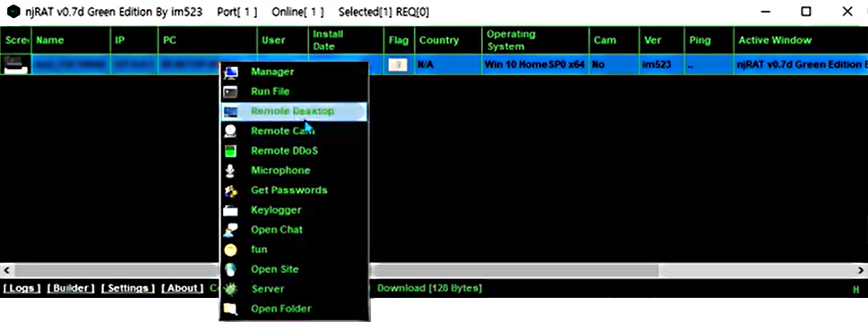

# Untitled

Maleware Njrat

Autoren: Marc Ammann, Joel Iselin, Roland Jaggi

Juventus Schule HF Zürich

Hacking Exposed

## Versionierung

| **Status** | Entwurf |
| :--- | :--- |
| **Titel** | Maleware Njrat |
| **Referenz** | . |
| **Modul** | Hacking Exposed |
| **Version** | 001 |
| **Datum** | 21.09.2020 |
| **Bildungsinstitut** | Juventus Technikerschule HF |
| **Spezialisierung** | Systemtechnik, Applikationsentwicklung |
| **Autor** | Marc Ammann, Joel Iselin, Roland Jaggi |
| **Funktion** | Studierende |
|  |  |

Inhaltsverzeichnis

[1 Versionierung 2]()

[3 Zuständigkeiten 3]()

[3.1 Roland 3]()

[3.2 Marc 3]()

[3.3 Joel 3]()

[4 Änderungsverzeichnis 3]()

[5 Einleitung 4]()

[6 Beschreibung der Malware 5]()

[7 Beschreibung eines konkreten Malwarebefalls 6]()

[8 Illustration 7]()

[9 Abwehrmassnahmen 7]()

[10 Schlusswort 8]()

[11 Literaturverzeichnis 8]()

## Zuständigkeiten

### Roland

### Marc

### Joel

## Änderungsverzeichnis

| Version | Datum | Änderung | Autor |
| :--- | :--- | :--- | :--- |
| 001 | 21.09.2020 | Initialversion, Vorlage erstellen | MA |
| 002 | 04.10.2020 | Start der Doku über Njrat | JI |
|  |  |  |  |
| 004 | 14.11.2020 | Gruppenarbeit um das Dokument fertig zu stellen | RJ, MA, JI |
|  |  |  |  |
|  |  |  |  |
|  |  |  |  |

Table 1: Änderungstabelle

\*

## Einleitung

In dieser Arbeit möchten wir die Malware Njrat genauer betrachten. Njrat ist ein Trojaner oder RAS-Trojaner \(Remote Access Trojaner\). Er ermöglicht es dem Programminhaber die Kontrolle über befallene Systeme zu übernehmen.

* Es wird darauf eingegangen wie verbreitet dieser Trojaner ist und wo der Ursprung vermutet wird.
* Auch wird analysiert, wie es zu einem Befall kommt.
* Wie man einen Befall feststellen kann und auch wieder los wird.

Hauptteil

## Beschreibung der Malware

 Wie heisst die Malware und was macht sie? Wann wurde sie zuerst / zuletzt gesichtet? Wie ordnen Sie diese Malware im Vergleich zu anderer Malware ein? Woher stammt die Malware \(vermutlich\)? Gegen wen wurde die Malware eingesetzt und mit welchem Zweck?

NjRat ist eine Malware, die zu der Kategorie der RAS-Trojaner gehört. Die Installation erfolgt in der Regel, ohne sich bemerkbar zu machen. Nach der Installation läuft die Malware im Hintergrund, ohne die Aufmerksamkeit von dem Benutzer auf sich zu ziehen. Dabei sammelt sie verschiedenste sensible Daten.

In den meisten Fällen versuchen die Cyberkriminellen ihre Opfer dazu verleiten, Programme dieser Art herunter zu laden. Hinter der Malware NjRat scheint eine Organisation mit dem Namen Sparclyheason zu stecken. Die Software fand vor allem Anwendung im mittleren Osten und wurde durch Phishing verbreitet.

Cyberkriminelle benutzen njRat Trojaner-ähnliche Programme, um Informationen über das System zu sammeln, verschiedene Benutzernamen und Passwörter, sowie persönliche, sensible Details zu stehlen. Außerdem kann es benutzt werden, um verschiedene, bösartige Software herunterzuladen und zu installieren. In der Regel senden Programme dieser Art alle gesammelten Daten an externe Server, die von Cyberkriminellen kontrolliert werden. Gestohlene/aufgezeichnete Daten könnten für Erpressung missbraucht werden oder um sonst irgendwie Gewinne zu machen. Indem Sie Zugang auf verschiedene persönliche Konten haben, könnten Cyberkriminelle für ihre Opfer Privatsphäre Probleme oder sogar finanzielle Verluste verursachen. Wenn es benutzt wird, um bösartige Programme herunterzuladen, könnte njRat [Ransomware-artige Viren](https://www.pcrisk.de/allgemeinen-computer-infektionsarten#ransomware) herunterladen, die gewöhnlich benutzt werden, um Zugriff auf gespeicherte Dateien eines Computers zu bekommen, außer dass ein Lösegeld bezahlt wird. Wenn es irgendeinen Grund gibt zu glauben, dass njRat installiert ist, raten wir dringen, es so schnell wie möglich zu entfernen/deinstallieren. Sonst kann es eine Vielzahl von Problemen, von Daten, finanziellen Verlusten, bis hin zu zusätzlichen Computerinfektionen verursachen.

Zusammenfassung Njrat

| **Name** | Njrat |
| :--- | :--- |
| **Art der Bedrohung** | Trojaner, Passwort-stehlender Virus, Banking-Malware, Spyware |
| **Verbreitungsmethoden** | Infizierte E-Mail-Anhänge, bösartige Online-Werbung, Social Engineering, Software-Cracks. |
| **Symptome** | Trojaner wurden entwickelt, um den Computer des Opfers heimlich zu infiltrieren und zu schweigen, so dass auf einem infizierten Computer keine besonderen Symptome deutlich sichtbar sind. |
| **Schaden** | Kompletter Zugriff auf Rechner, Gestohlene Bankdaten, Passwörter, Identitätsdiebstahl, Computer des Opfers, der einem Botnetz hinzugefügt wurde. |

## Beschreibung eines konkreten Malwarebefalls

◦ Beschreiben Sie den Angriffsvektor und den Ablauf eines erfolgreichen Angriffes wenn möglich am Beispiel eines konkreten, öffentlich bekannten Vorfalles.

◦ Geben Sie an, wie das Opfer wieder vom Angriff befreit werden konnte.

Die Software verbreitet sich z.B. durch E-Mails, die angefügte Dateien enthalten. Diese Dateien können PDF, MS Office Dokumente, JavaScript Dateien oder ausführbare Dateien sein. Eine weitere Art sie zu verbreiten, ist die Benutzen unzuverlässiger Software-Downloadquellen, wie Peer-to-Peer Netzwerke, inoffizielle Webseiten, Downloader Dritter und so weiter.

Abbildung 1: njRAT Software

## Illustration

## Wie bekommt man ihn wieder loss

## Abwehrmassnahmen

* Überlegen Sie sich, wie man sich vor diesem Angriff schützen kann und begründen Sie Ihre Massnahmen.
* Keine Allgemeinplätze die immer gültig sind wie bspw. «Backup der Daten machen»,

«Virenscanner in aktueller Version einsetzen» oder «sichere Passwörter verwenden».

Wenn eine erhaltene E-Mail von einem unbekannten Absender kommt, ist Vorsicht geboten. Dateien, die E-Mails angeheftet werden sind immer als Bedrohung zu betrachten. Nicht jeder Link muss geöffnet werden. Software sollte nicht von inoffiziellen Webseiten, unter Verwendung von Downloadern Dritter, Peer-to-Peer Netzwerken und ähnliche Quellen, heruntergeladen werden. Der sicherste Download ist über einen Store oder auf der Webseite des Herstellers. Ein weiterer Weg, um Computerinfektionen zu vermeiden, ist die Installation eines bekannten Anti-Spyware oder Antivirus Programms, das immer aktiviert bleiben sollte. Wenn Sie glauben, dass Ihr Computer bereits infiziert ist, empfiehlt es sich, einen Scan mit «[Combo Cleaner](https://www.pcrisk.de/download-combo-cleaner)» durchführen, um infiltrierende Malware automatisch zu entfernen.

## Schlusswort

Durch diese Arbeit ist man sich den Gefahren im Internet einmal mehr bewusst. Wachsamkeit macht in jeder Hinsicht Sinn um Bedrohungen frühzeitig zu erkennen um die nötigen Abwehrmassnahmen zu treffen oder um den Schaden in Grenzen zu behalten. Malware gehört bis heute zu einer der grössten Bedrohungen im Web.

## Literaturverzeichnis

[https://de.continuousdev.com/remote-access-trojan-attacks-on-the-rise-how-you-can-protect-yourself-2-33744-12463](https://de.continuousdev.com/remote-access-trojan-attacks-on-the-rise-how-you-can-protect-yourself-2-33744-12463)

https://www.pcrisk.de/ratgeber-zum-entfernen/9117-njrat-malware

