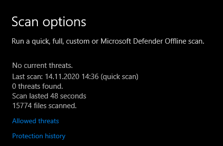
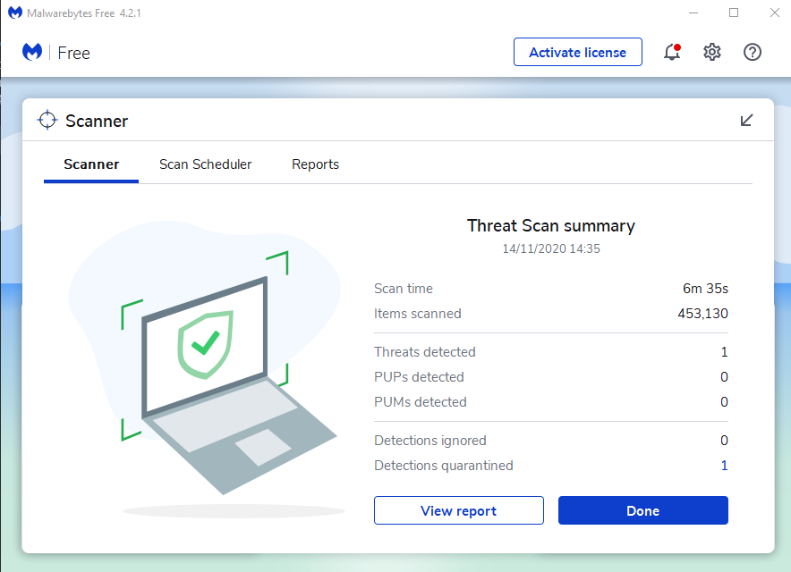

# NjRAT

## Versionierung

| **Status** | Final |
| :--- | :--- |
| **Titel** | Maleware NjRAT |
| **Modul** | Hacking Exposed |
| **Version** | 003 |
| **Datum** | 14.11.2020 |
| **Bildungsinstitut** | Juventus Technikerschule HF |
| **Spezialisierung** | Systemtechnik, Applikationsentwicklung |
| **Autor** | Marc Ammann, Joël Iselin, Roland Jaggi |
| **Funktion** | Studierende |

Inhaltsverzeichnis

[1 Versionierung 1]()

[3 Planung 2]()

[4 Einleitung 3]()

[5 Beschreibung 3]()

[5.1 Was macht der Trojaner 3]()

[5.2 Verbreitung und Ursprung 3]()

[5.2.1 Phishing 3]()

[5.3 Einsatzzweck von NjRAT 3]()

[5.4 Zusammenfassung NjRAT 4]()

[6 Beschreibung eines konkreten Malwarebefalls 4]()

[7 Illustration 5]()

[8 Wie bekommt man ihn wieder los 6]()

[8.1 Antivirus Scans 6]()

[9 Abwehrmassnahmen 8]()

[9.1 Abwehrmassnahmen in einem Unternehmen 8]()

[9.2 Abwehrmassnahmen beim Befall von NjRAT 8]()

[10 Schlusswort 8]()

[11 Literaturverzeichnis 8]()

## Planung

## Einleitung

In dieser Arbeit möchten wir die Malware NjRAT genauer betrachten. Es wird darauf eingegangen wie sich der Trojaner verbreitet und wo der Ursprung vermutet wird. Auch wird darauf eingegangen, wie ein Befall erkannt werden kann und was man tun kann, um einen Befall wieder Loss zu werden.

## Beschreibung

### Was macht der Trojaner

NjRAT ist eine Malware, die zu der Kategorie der RAS-Trojaner gehört \(Remote Access Trojaner\).

Er ermöglicht es dem Programminhaber die Kontrolle über befallene Systeme zu übernehmen. Die Cyberkriminellen benutzen den Zugriff, um auf den infizierten Systemen Daten zu sammeln.

Der Zugriff kann auch genutzt werden, um weitere Schädliche Programme auf das System zu installieren mit dem die Suche nach den gesuchten Daten vereinfacht wird und Programme die gesammelte Daten an externe Server weiter leiten die von den Cyberkriminellen kontrolliert werden.

### Verbreitung und Ursprung

In den meisten Fällen versuchen die Cyberkriminellen ihre Opfer dazu verleiten, Programme dieser Art herunter zu laden. Hinter der Malware NjRAT scheint eine Organisation mit dem Namen Sparclyheason zu stecken. Die Software fand vor allem Anwendung im mittleren Osten und wurde durch Phishing verbreitet.

#### Phishing

Unter dem Begriff Phishing versteht man Versuche, sich über gefälschte Webseiten, E-Mails oder Kurznachrichten als vertrauenswürdiger Kommunikationspartner in einer elektronischen Kommunikation auszugeben.

[https://de.wikipedia.org/wiki/Phishing](https://de.wikipedia.org/wiki/Phishing)

### Einsatzzweck von NjRAT

Die Installation erfolgt in der Regel, ohne sich bemerkbar zu machen. Nach der Installation läuft die Malware im Hintergrund, ohne die Aufmerksamkeit von dem Benutzer auf sich zu ziehen. Dabei sammelt sie verschiedenste sensible Daten.

Es geht den Cyberkriminellen hauptsächlich darum sensible Daten zu bekommen z.B. Passwärter und Benutzernamen oder Fotos damit die Opfer für ein Lösegeld erpresst werden können.

### Zusammenfassung NjRAT

| **Name** | NjRAT |
| :--- | :--- |
| **Art der Bedrohung** | Trojaner, Passwort-stehlender Virus, Banking-Malware, Spyware |
| **Verbreitungsmethoden** | Infizierte E-Mail-Anhänge, bösartige Online-Werbung, Social Engineering, Software-Cracks. |
| **Symptome** | Trojaner wurden entwickelt, um den Computer des Opfers heimlich zu infiltrieren und zu schweigen, so dass auf einem infizierten Computer keine besonderen Symptome deutlich sichtbar sind. |
| **Schaden** | Kompletter Zugriff auf Rechner, Gestohlene Bankdaten, Passwörter, Identitätsdiebstahl, Computer des Opfers, der einem Botnetz hinzugefügt wurde. |

Tabelle 1: Zusammenfassung NjRAT

## Beschreibung eines konkreten Malwarebefalls

Cybereason Nocturnus untersucht eine Kampagne, bei der Angreifer mehrere Hacker-Tools mit NjRAT, einem bekannten RAT, mit Trojanern versehen. Die Kampagne ermöglicht den Angreifern schließlich den vollständigen Zugriff auf die Zielmaschine. Die Bedrohungsakteure, die hinter dieser Kampagne stehen, posten Malware, die in verschiedene Hacker-Tools eingebettet ist, und Cracks für diese Tools auf mehreren Websites. Sobald die Dateien heruntergeladen und geöffnet sind, sind die Angreifer in der Lage, den Rechner des Opfers vollständig zu übernehmen. In diesem Aufsatz stellen wir unsere Analyse der TTPs der Angreifer und die Indikatoren für eine Kompromittierung vor. Bei der Untersuchung dieser Kampagne haben wir Hunderte von trojanischen Dateien und eine Menge Informationen über die Infrastruktur der Bedrohungsakteure gefunden.

Abbildung 2: NjRAT Software mit Zugriff auf eine infizierte Maschine

## Illustration

In der nachfolgenden Illustration wird der Ablauf einer NjRAT Attacke illustriert.

Abbildung 3: Verdeutlichung eines Angriffs

## Wie bekommt man ihn wieder los

Eine erfolgreiche Installation wieder los zu werden, ist gar nicht mal so leicht und beinhaltet ein paar Schritte die getätigt werden müssen, damit dieser Angriff rückgängig gemacht werden kann. Für eine Person, welche sich nicht auskennt, ist es fast schon unmöglich diesen zu entfernen.

Ist es ein Persönlicher Computer, so wäre es am klügsten, effizientesten und sichersten diesen komplett neu zu installieren. Es kann immer sein, dass es Ableger hat und der/die Angreifer nach wie vor Zugriff auf das System haben. Wichtig ist es jedoch zu verstehen, dass die meisten Antivirus diese Art von Angriff erkennen somit ist es wichtig das AV Programm aktuell zu halten.

Empfehlung um eine solche Attacke wieder los zu werden sind die folgenden:

* Registry aufräumen von allen manipulierten Werten
* Löschen der verdächtigen Kind Instanzen aus dem Speicher
* Blockieren des Netzwerkverkehrs von dem die Attacke gekommen ist
* Offene Ports blockieren
* Aktualisiertes Antivirus Programm laufen lassen
* Malware Programm durchlaufenlassen

### Antivirus Scans

Abbildung 4: Windows Antivirus schneller Scan

Abbildung 5: Windows Antivirus vollwertiger Scan

Abbildung 6: Malwarebyte Scan

## Abwehrmassnahmen

Wenn eine erhaltene E-Mail von einem unbekannten Absender kommt, ist Vorsicht geboten. Dateien, die E-Mails angeheftet werden, sind immer als Bedrohung zu betrachten. Nicht jeder Link muss geöffnet werden. Software sollte nicht von inoffiziellen Webseiten, unter Verwendung von Downloadern Dritter, Peer-to-Peer Netzwerken und ähnliche Quellen, heruntergeladen werden. Der sicherste Download ist über einen Store oder auf der Webseite des Herstellers.

Ein weiterer Weg, um Computerinfektionen zu vermeiden, ist die Installation eines bekannten Anti-Spyware oder Antivirus Programms, das immer aktiviert bleiben sollte. Wenn Sie glauben, dass Ihr Computer bereits infiziert ist, empfiehlt es sich, einen Scan mit «[Combo Cleaner](https://www.pcrisk.de/download-combo-cleaner)» durchführen, um infiltrierende Malware automatisch zu entfernen.

### Abwehrmassnahmen in einem Unternehmen

Um in einem Unternehmen den Befall einer Maleware Attacke zu verhindern, müssen Mitarbeiter zwingend geschult werden mit Awareness Trainings. Die Trainings sollten vor Allem Phishing und Email-Sicherheit behandeln. Die Benutzerprofile von Mitarbeitern sollten nicht mit Administratorenrechten betrieben werden.

### Abwehrmassnahmen beim Befall von NjRAT

- Kamera- und Mikrofone deaktivieren, gegebenenfalls abdecken

- Daten sichern; wenn ein Backup besteht, heikle Daten auf dem Rechner löschen

- externe Laufwerke deaktivieren oder abstecken

## Schlusswort

Durch diese Arbeit ist man sich den Gefahren im Internet einmal mehr bewusst. Wachsamkeit macht in jeder Hinsicht Sinn um Bedrohungen frühzeitig zu erkennen um die nötigen Abwehrmassnahmen zu treffen oder um den Schaden in Grenzen zu behalten. Malware gehört bis heute zu einer der grössten Bedrohungen im Web.

## Literaturverzeichnis

[https://de.continuousdev.com/remote-access-trojan-attacks-on-the-rise-how-you-can-protect-yourself-2-33744-12463](https://de.continuousdev.com/remote-access-trojan-attacks-on-the-rise-how-you-can-protect-yourself-2-33744-12463)

https://www.pcrisk.de/ratgeber-zum-entfernen/9117-njrat-malware

